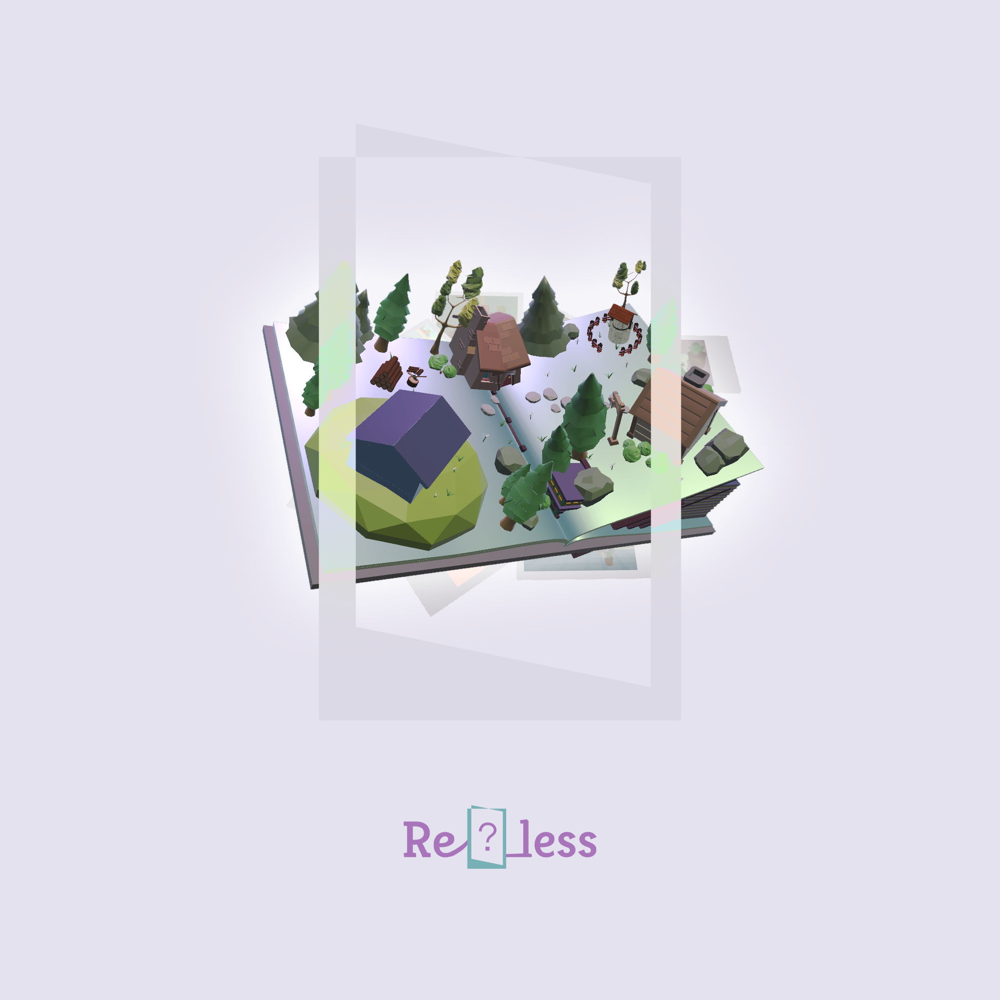

# 
   <kbd>[아카이브](https://github.com/2024-Adoor/Re_less/discussions/categories/%EC%95%84%EC%B9%B4%EC%9D%B4%EB%B8%8C)</kbd> <kbd>[졸업전시 회고](https://github.com/2024-Adoor/Re_less/discussions/categories/%EC%A1%B8%EC%97%85%EC%A0%84%EC%8B%9C-%ED%9A%8C%EA%B3%A0)</kbd> <kbd>[연습 리포지토리](https://github.com/2024-Adoor/practice)</kbd> <kbd>[프로젝트](https://github.com/orgs/2024-Adoor/projects/3)</kbd> 

숭실대학교 글로벌미디어학부 2024 졸업전시 Adoor 팀 졸업작품 Re□less입니다.

## 작품 소개

### 전시 소개

> <Re□less>는 책을 매개체로 꿈 속을 넘나들며 잠에 빠진 친구들을 구하는 혼합 현실(MR) 게임입니다. 작아진 몸으로 거대한 방을 탐험하는 꿈 같은 여정을 경험해 보세요.

#### Links
- 🎞️ [시연 영상](https://www.youtube.com/watch?v=jNOlHoWs5Wk)
- 🗒️ [게임 방법](https://github.com/2024-Adoor/Re_less/discussions/28)
- 📖 스토리

## 제작

### 팀

- 팀장 **송아정**

- 팀원 **서수민**

- 팀원 **김준영** [@plwast-ints](https://github.com/plwast-ints)
  - 글로벌미디어학부 21학번
  - 주로 MR 파트 개발(그리기, 패스스루, 퀘스트 API 관련), 게임 구조 & 코드 정리, 로고 제작

### 환경

- **Unity**: 2022.3.21f1
  - URP (Meta's fork)
  - Meta XR SDK v64
    - Meta XR Core SDK
    - Meta XR Interaction SDK
    - Meta XR MR Utility Kit
- **Device**: Meta Quest 3
- Autodesk Maya, Blender

##
